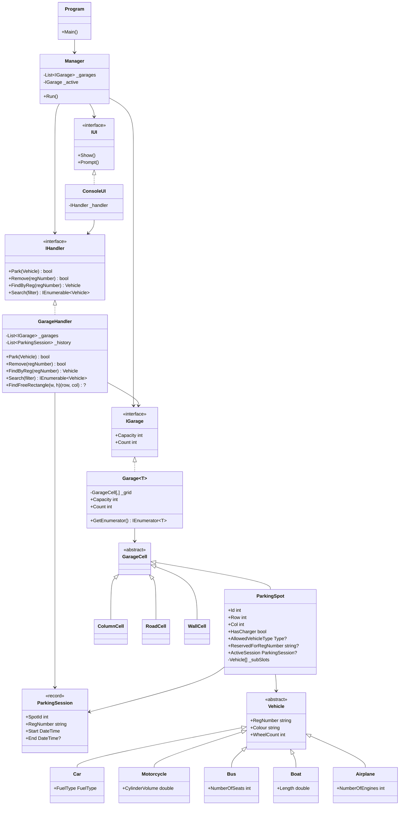
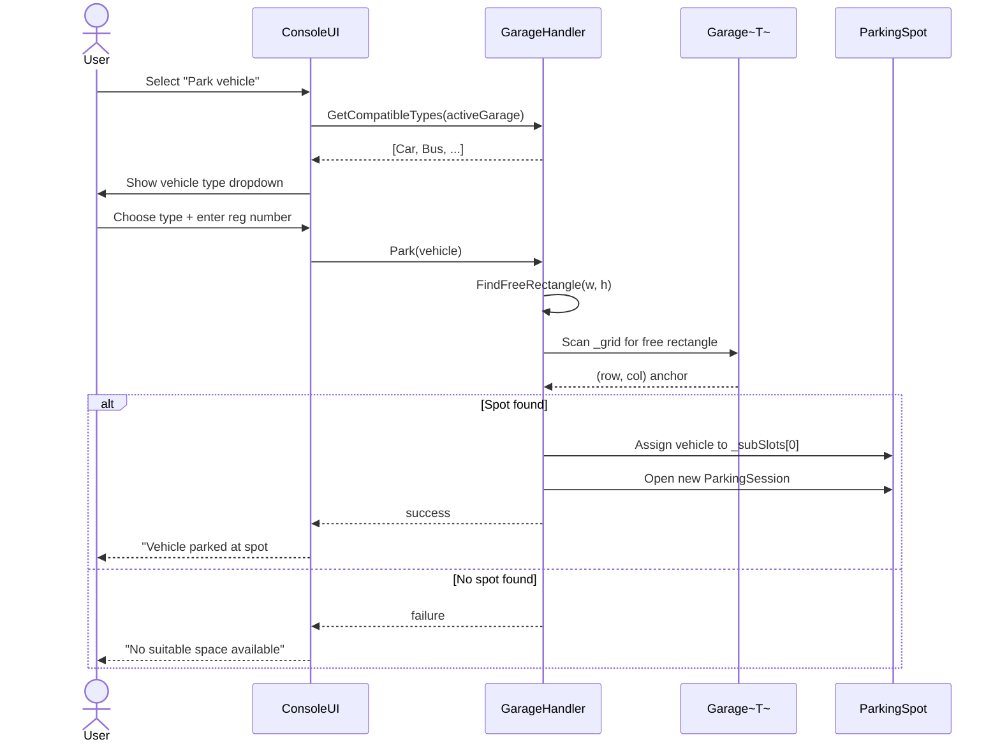
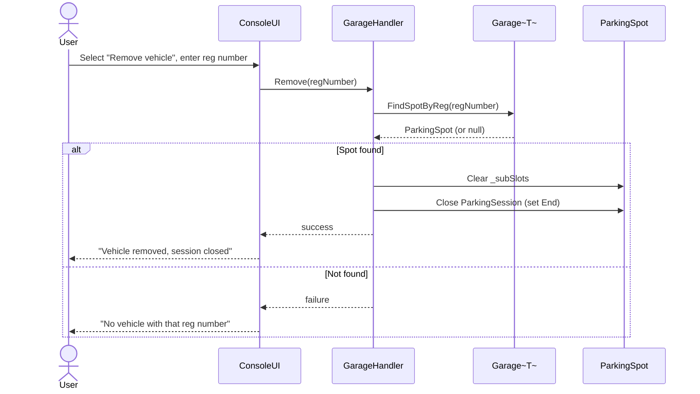

# Diagrams — Garage 2.0

## Class Diagram

```mermaid
classDiagram
    direction TB

    class Program {
        +Main()
    }

    class Manager {
        -List~IGarage~ _garages
        -IGarage _active
        +Run()
    }

    class IUI {
        <<interface>>
        +Show()
        +Prompt()
    }

    class IHandler {
        <<interface>>
        +Park(Vehicle) bool
        +Remove(regNumber) bool
        +FindByReg(regNumber) Vehicle
        +Search(filter) IEnumerable~Vehicle~
    }

    class IGarage {
        <<interface>>
        +Capacity int
        +Count int
    }

    class ConsoleUI {
        -IHandler _handler
    }

    class GarageHandler {
        -List~IGarage~ _garages
        -List~ParkingSession~ _history
        +Park(Vehicle) bool
        +Remove(regNumber) bool
        +FindByReg(regNumber) Vehicle
        +Search(filter) IEnumerable~Vehicle~
        +FindFreeRectangle(w, h) (row, col)?
    }

    class Garage~T~ {
        -GarageCell[,] _grid
        +Capacity int
        +Count int
        +GetEnumerator() IEnumerator~T~
    }

    class GarageCell {
        <<abstract>>
    }

    class ParkingSpot {
        +Id int
        +Row int
        +Col int
        +HasCharger bool
        +AllowedVehicleType Type?
        +ReservedForRegNumber string?
        +ActiveSession ParkingSession?
        -Vehicle[] _subSlots
    }

    class ColumnCell
    class RoadCell
    class WallCell

    class ParkingSession {
        <<record>>
        +SpotId int
        +RegNumber string
        +Start DateTime
        +End DateTime?
    }

    class Vehicle {
        <<abstract>>
        +RegNumber string
        +Colour string
        +WheelCount int
    }

    class Car {
        +FuelType FuelType
    }

    class Motorcycle {
        +CylinderVolume double
    }

    class Bus {
        +NumberOfSeats int
    }

    class Boat {
        +Length double
    }

    class Airplane {
        +NumberOfEngines int
    }

    Program --> Manager
    Manager --> IUI
    Manager --> IHandler
    Manager --> IGarage

    IUI <|.. ConsoleUI
    IHandler <|.. GarageHandler
    IGarage <|.. Garage

    ConsoleUI --> IHandler
    GarageHandler --> IGarage
    GarageHandler --> ParkingSession

    Garage --> GarageCell

    GarageCell <|-- ParkingSpot
    GarageCell <|-- ColumnCell
    GarageCell <|-- RoadCell
    GarageCell <|-- WallCell

    ParkingSpot --> ParkingSession
    ParkingSpot --> Vehicle

    Vehicle <|-- Car
    Vehicle <|-- Motorcycle
    Vehicle <|-- Bus
    Vehicle <|-- Boat
    Vehicle <|-- Airplane
```

---

## Sequence Diagram — Park a Vehicle

```mermaid
sequenceDiagram
    actor User
    participant UI as ConsoleUI
    participant H as GarageHandler
    participant G as Garage~T~
    participant S as ParkingSpot

    User->>UI: Select "Park vehicle"
    UI->>H: GetCompatibleTypes(activeGarage)
    H-->>UI: [Car, Bus, ...]
    UI->>User: Show vehicle type dropdown
    User->>UI: Choose type + enter reg number

    UI->>H: Park(vehicle)
    H->>H: FindFreeRectangle(w, h)
    H->>G: Scan _grid for free rectangle
    G-->>H: (row, col) anchor

    alt Spot found
        H->>S: Assign vehicle to _subSlots[0]
        H->>S: Open new ParkingSession
        H-->>UI: success
        UI-->>User: "Vehicle parked at spot #42"
    else No spot found
        H-->>UI: failure
        UI-->>User: "No suitable space available"
    end
```

---

## Sequence Diagram — Remove a Vehicle

```mermaid
sequenceDiagram
    actor User
    participant UI as ConsoleUI
    participant H as GarageHandler
    participant G as Garage~T~
    participant S as ParkingSpot

    User->>UI: Select "Remove vehicle", enter reg number
    UI->>H: Remove(regNumber)
    H->>G: FindSpotByReg(regNumber)
    G-->>H: ParkingSpot (or null)

    alt Spot found
        H->>S: Clear _subSlots
        H->>S: Close ParkingSession (set End)
        H-->>UI: success
        UI-->>User: "Vehicle removed, session closed"
    else Not found
        H-->>UI: failure
        UI-->>User: "No vehicle with that reg number"
    end
```
